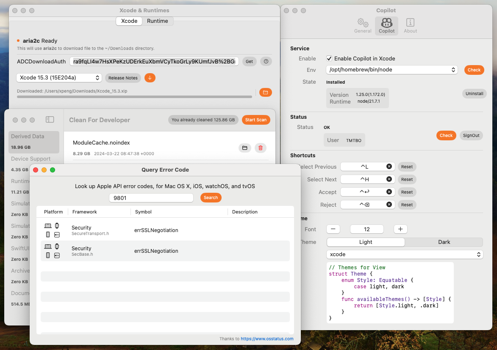
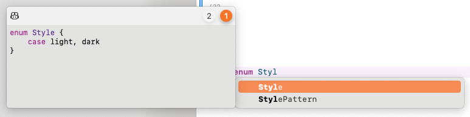
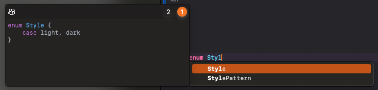
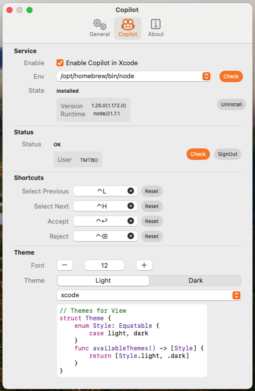
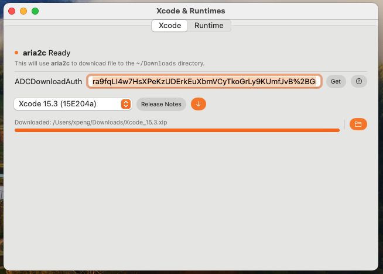
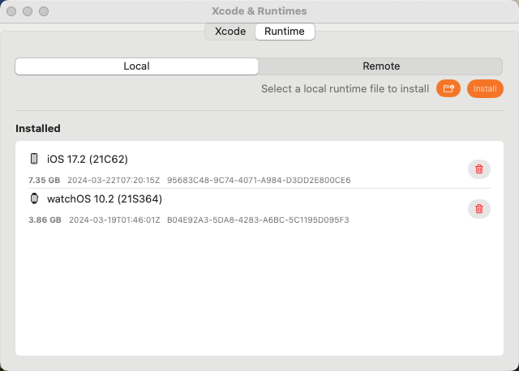
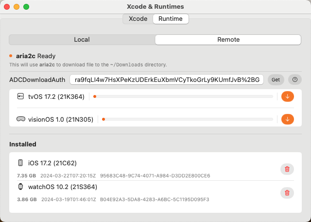
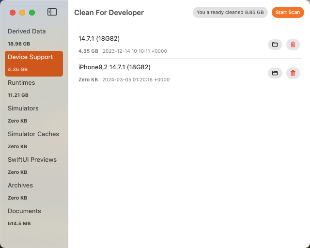
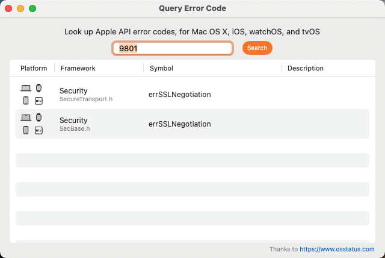

# Welcome to the Official XcodePilot Website

## About XcodePilot

XcodePilot is a powerful development tool designed to provide integrated features and tools for Apple platform developers, aiming to enhance development efficiency and simplify the development process. XcodePilot integrates multiple tools, including Copilot, Xcode and Runtime management, simulator management, cache cleaning, and keyboard shortcuts customization. We continuously introduce new features to meet the needs of developers.

## Key Features

### Copilot Integration

XcodePilot comes with the AI-powered coding assistant, Copilot. It utilizes machine learning technology to analyze code repositories and context, providing intelligent code completion, automatic fixes, and code suggestions. Copilot significantly reduces repetitive tasks during coding and improves development efficiency.

    
    
    

### Xcode and Runtime Management

XcodePilot offers convenient management of Xcode and Runtime versions. Developers can easily switch between and manage different versions of Xcode and Runtime to meet the requirements of various projects. Additionally, XcodePilot supports automatic detection and installation of the latest Xcode and Runtime versions, ensuring developers always use up-to-date tools.

    
    
    

### Simulator Management

XcodePilot includes simulator management functionality, allowing for quick launching, closing, and managing of iOS and macOS simulators. Developers can easily debug and test applications, thereby improving development efficiency.

### Cache Cleaning

XcodePilot provides a one-click feature to clean Xcode caches, helping developers free up disk space and enhance Xcode's performance. By removing expired cache files and temporary files, XcodePilot helps developers maintain a healthy state of Xcode.

### Keyboard Shortcuts Customization

XcodePilot allows developers to customize keyboard shortcuts to fit their individual development habits and workflows. Developers can set shortcuts for commonly used actions, thereby improving development efficiency.

### Error Code Lookup

XcodePilot also provides an error code lookup feature, allowing developers to easily search for and understand common error codes encountered during development. By providing detailed explanations and possible solutions, XcodePilot helps developers troubleshoot and resolve issues more efficiently.

### More Features Coming Soon!

Our team is continuously improving and expanding the features of XcodePilot to meet the evolving needs of developers. We highly appreciate your valuable feedback and suggestions to help us enhance the product. You can reach us through the following channels:

- **Official Website**: [XcodePilot](https://xcodepilot.thriller.fun)
- **Email**: thrillerone@hotmail.com
- **Social Media**:
  - Twitter: [@XcodePilot](https://twitter.com/XcodePilot)
  - Facebook: [XcodePilot](https://www.facebook.com/XcodePilot)

Our team will carefully listen to your feedback and continuously strive to improve the quality and functionality of XcodePilot, providing a better experience for developers.

Thank you for choosing XcodePilot, and we look forward to working with you to create even more powerful development tools!
